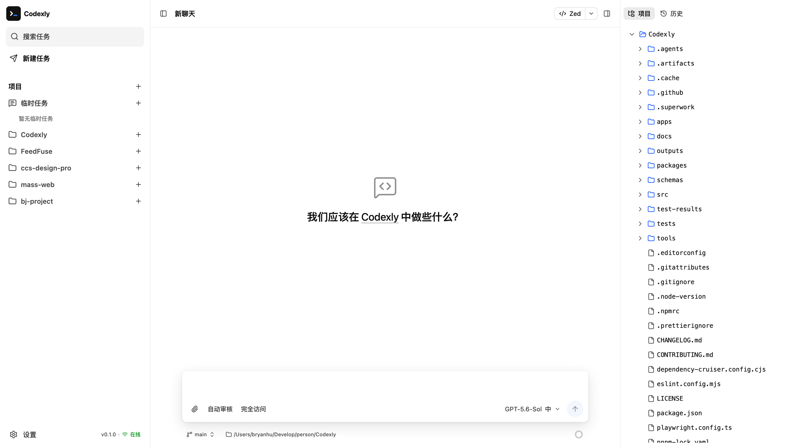

<p align="center">
  
</p>

<h1 align="center">Codexly</h1>

<p align="center">
  
  
  
  
  
  
  <a href="./LICENSE">
    
  </a>
</p>

<p align="center">
  A local AI coding workspace for using Codex in a browser.
</p>

<p align="center">
  <a href="#features">Features</a>
  ·
  <a href="#quick-start">Quick Start</a>
  ·
  <a href="./README.zh-CN.md">简体中文</a>
  ·
  <a href="./LICENSE">License</a>
</p>

## Preview



## Features

- Run project or temporary Codex tasks and follow responses, commands, and file changes in real time
- Keep follow-up work in a persistent task queue, and edit queued messages and attachments before they run
- Attach files and images, reference project files with `@`, and answer input requests from configured MCP servers
- Choose the model, reasoning effort, Fast mode, approval behavior, and file access level for each task
- Organize ordered multi-root projects, archive project or temporary tasks, and permanently delete tasks when needed
- Inspect, preview, rename, and delete project files; review diffs; manage branches and worktrees; and commit or push changes
- Fork a task from an AI response and continue it in a new Git worktree
- Add animated workspace pets with separate task activity bubbles and custom PNG or WebP sprite manifests
- Manage a collection of custom workspace backgrounds, or use Bing daily images, with automatic foreground colors, overlay opacity, and blur
- Access the workspace from another device on a trusted local network

## Requirements

- Node.js >=22.14.0
- Chrome/Chromium 116+, Firefox 124+, or Safari 17.4+

Codexly includes Codex CLI `0.153.4` through `@openai/codex`; a separate installation is not required. External binaries supplied through `--codex-bin <path>` or `CODEXLY_CODEX_BIN` must satisfy `>=0.153.4,<0.154.0`.

## Quick Start

Run the latest version without installing it:

```bash
npx --package @bryanhu/codexly@latest codexly start
```

Codexly opens the browser automatically. If it does not, use the address printed in the terminal; the default is `http://127.0.0.1:3210`. Keep the terminal running and press `Ctrl+C` to stop.

On first launch, sign in with ChatGPT or configure an OpenAI-compatible service that supports the Responses API and `GET /models`.

For regular use, install Codexly globally:

```bash
npm install --global @bryanhu/codexly
codexly
```

## Usage

Select **New task** for work that does not need a project. For repository work, add one or more host directories as ordered project roots, create a task, and submit your request with any required files, images, project references, or Skills. Archived tasks can be restored or permanently deleted from the project task list.

Task controls set the model, reasoning, Fast mode, approval, and file access behavior. Notification preferences and the last complete project settings are saved for later tasks. The right inspector provides project files, sources, code changes, Git history, review, and commit actions. Project directories and files always come from the computer running Codexly, including when the UI is opened on another device.

## Local Network Access

Start trusted LAN access with:

```bash
codexly start --lan
```

The terminal prints the LAN address and a random access password. Common options are:

| Option                      | Purpose                                                                                    |
| --------------------------- | ------------------------------------------------------------------------------------------ |
| `--port <port>`             | Choose the starting port; occupied ports are skipped automatically                         |
| `--lan-password <password>` | Set a 16-128 character password containing uppercase, lowercase, number, and symbol        |
| `--allowed-host <domain>`   | Allow an exact reverse proxy domain; repeat the option for multiple domains                |
| `--session-ttl <duration>`  | Set a fixed LAN session lifetime such as `12h`; omitted sessions last until server restart |

Quote passwords containing shell-special characters. LAN mode uses unencrypted HTTP, so use it only on a trusted network and never expose it directly to the internet. Restarting Codexly invalidates the password and all sessions.

## Diagnostics and Updates

Run `codexly doctor` when startup, Codex, or local data checks fail. Run `codexly --help` for the current command and option reference.

Interactive startup and **Settings > About** check for new releases. A global installation can also be updated with:

```bash
npm install --global @bryanhu/codexly@latest
```

## Help

- [Report an issue](https://github.com/BryanHoo/Codexly/issues)
- [Contributing guide](CONTRIBUTING.md)
- [Security policy](SECURITY.md)
- [Changelog](CHANGELOG.md)

## Community

Thanks to the [LinuxDO](https://linux.do/) community for their support

## License

[MIT](LICENSE)
