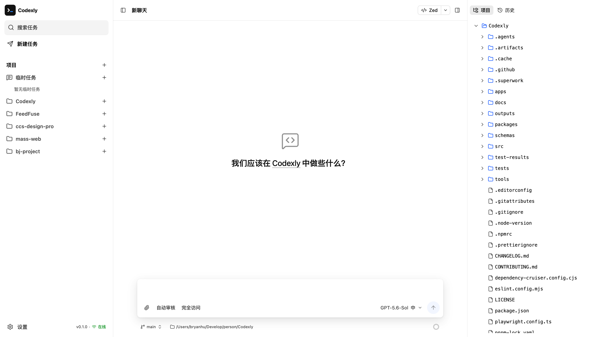

<p align="center">
  
</p>

<h1 align="center">Codexly</h1>

<p align="center">
  A local AI coding workspace for desktop and browser.
</p>

Codexly keeps coding tasks, conversations, project files, and Git work in one place. Choose the desktop app for a self-contained workspace or run the Web edition locally and open it from a browser, including on a mobile device on your trusted network. Your projects and Codex runtime stay on the computer running Codexly.

<p align="center">
  <a href="#get-codexly">Get Codexly</a>
  ·
  <a href="#features">Features</a>
  ·
  <a href="./README.zh-CN.md">简体中文</a>
  ·
  <a href="./LICENSE">License</a>
</p>

## Get Codexly

| Edition | Best for                                                                                             | Get started                                                                                                                                                         |
| ------- | ---------------------------------------------------------------------------------------------------- | ------------------------------------------------------------------------------------------------------------------------------------------------------------------- |
| Desktop | A native workspace with an integrated terminal, task window, system notifications, and tray controls | [Download for Windows, Ubuntu, or macOS](https://github.com/BryanHoo/Codexly/releases) and follow the [desktop installation guide](desktop/docs/installation.en.md) |
| Web     | A local browser workspace accessible from your computer or another device on a trusted LAN           | Install Node.js 24+ and [start the Web edition](#start-the-web-edition)                                                                                             |

Desktop packages are available for Windows 10/11 x64, Ubuntu 24.04+ x64, macOS 14.5+ (Apple Silicon or Intel), and a separate Legacy build for macOS 12.4+ Intel. The packages are not OS code-signed; review the [installation instructions](desktop/docs/installation.en.md) before opening a download. The desktop app installs and verifies its own private Codex runtime on first launch.

## Web Preview



## Features

- Follow task responses, commands, approvals, reasoning summaries, and file changes as they arrive, with file edit timing and completion summaries; keep follow-up messages in a persistent queue.
- Read streaming Markdown responses and copy their source text; zoom and pan message images, project images, and wallpapers, or view them at their original size.
- Choose a model, reasoning effort, Fast mode, approval policy, and file access level for each task.
- Create projects and directories, search tasks, message history, and project files; inspect changes, work with branches and worktrees, and commit or push selected files.
- Identify each task's project through labels in the sidebar.
- Manage Skills, plugins, MCP services, projects, archived tasks, notifications, and scheduled work.

**Desktop** adds a native project terminal, global shortcuts, a separate task window, tray integration, and an app-private Codex installation. It supports Windows, Ubuntu, and macOS. See the [desktop guide](desktop/README.en.md) for its full feature set and update behavior.

**Web** runs a local server and opens in your browser. It supports trusted LAN access from phones and other devices, Docker deployment, task boards, Mermaid diagrams, and customizable workspace backgrounds. The Web edition includes Codex CLI `0.160.0` through `@openai/codex`; external binaries supplied through `--codex-bin <path>` or `CODEXLY_CODEX_BIN` must satisfy `>=0.160.0,<0.161.0`.

## Start the Web Edition

Requires Node.js >=24.0.0 and Chrome/Chromium 116+, Firefox 124+, or Safari 17.4+.

Run the latest version without installing it:

```bash
npx --package @bryanhu/codexly@latest codexly start
```

Codexly opens the browser automatically. If it does not, use the address printed in the terminal; the default is `http://127.0.0.1:3210`. Keep the terminal running and press `Ctrl+C` to stop.

Run `codexly --version` to check the installed version, or `codexly <command> --help` for command-specific options.

Only one Codexly instance can use a data directory. The instance lock is released automatically on exit or crash. Use different `--codex-home <directory>` values for independent instances.

On first launch, sign in with ChatGPT or configure an OpenAI-compatible service that supports the Responses API and `GET /models`.
Custom providers discover available models; basic reasoning levels remain selectable when model metadata omits them.

For regular use, install Codexly globally:

```bash
npm install --global @bryanhu/codexly@latest --registry=https://registry.npmmirror.com || npm install --global @bryanhu/codexly@latest --registry=https://registry.npmjs.org
codexly
```

The installation command tries the China mirror first, falls back to the official registry on failure, reuses the npm cache, and revalidates stale package metadata. `||` works in Bash, Zsh, cmd, and PowerShell 7+. In Windows PowerShell 5.1, run the command to the right of `||` separately if the first command fails.

## Docker

Download the user-facing Compose file and start the published image:

```bash
mkdir codexly && cd codexly
curl -fsSLO https://raw.githubusercontent.com/BryanHoo/Codexly/main/compose.yaml
curl -fsSLo .env.example https://raw.githubusercontent.com/BryanHoo/Codexly/main/.env.example
cp .env.example .env
docker compose pull
docker compose up --detach
docker compose logs --tail=50 codexly
```

Open `http://127.0.0.1:3210` and use the random pairing code printed in the logs. The default named volume preserves Codex login data and Codexly's SQLite state. On Linux and macOS, the Compose file mounts the host root at `/workspace`, so every mounted disk is available to the project picker. Set `CODEXLY_WORKSPACE` to expose only one directory and preserve its absolute path inside the container:

```bash
CODEXLY_WORKSPACE=/path/to/projects docker compose up --detach
```

When binding the host `CODEXLY_CODEX_HOME`, also set `CODEXLY_WORKSPACE` to a common parent of the existing projects. Their absolute paths then remain identical on the host and in the container.

The container does not automatically inherit the host Git identity. Set `CODEXLY_GIT_CONFIG` to a global Git config file visible inside the container. With an identity-mapped Linux or macOS workspace, use the absolute path to the host `~/.gitconfig` directly. For SSH remotes, set `CODEXLY_SSH_HOME` to the absolute path of the host `~/.ssh` directory.

Docker can only access host paths shared with the Docker engine. On Windows, set `CODEXLY_WORKSPACE` to a shared drive such as `C:/` and set `CODEXLY_WORKSPACE_TARGET=/workspace`. Windows and Linux container paths use different absolute path formats, so a Codex Home containing host project records cannot be reused directly. Add extra bind mounts and repeat `--workspace` in `command` when multiple drives are required.

| Variable                   | Purpose                                                                |
| -------------------------- | ---------------------------------------------------------------------- |
| `CODEXLY_VERSION`          | Select the GHCR image tag; defaults to `latest`                        |
| `CODEXLY_PORT`             | Set both the host and container port; defaults to `3210`               |
| `CODEXLY_WORKSPACE`        | Restrict the workspace and preserve its absolute path; defaults to `/` |
| `CODEXLY_WORKSPACE_TARGET` | Override the container path; use `/workspace` on Windows               |
| `CODEXLY_GIT_CONFIG`       | Select a container-visible global Git config file                      |
| `CODEXLY_SSH_HOME`         | Mount host SSH config, keys, and `known_hosts` read-only               |
| `CODEXLY_CODEX_HOME`       | Bind a host Codex home instead of the managed `codexly-data` volume    |
| `CODEXLY_LAN_PASSWORD`     | Set a strong fixed access password instead of the logged random code   |
| `CODEXLY_ALLOWED_HOSTS`    | Allow comma-separated exact reverse proxy domains                      |
| `CODEXLY_SESSION_TTL`      | Set a fixed session lifetime such as `12h`                             |

The image entrypoint accepts all normal CLI arguments, so orchestration platforms can replace `command` when needed. See the [complete Docker Compose deployment guide](docs/docker-deployment.md) for workspace, multiple-disk, Codex Home, update, backup, and troubleshooting instructions. Run `pnpm docker:build && pnpm docker:test` in a development checkout to build and smoke-test the local image.

## Using the Web Edition

Select **New task** for work that does not need a project. For repository work, add one or more host directories as ordered project roots, create a task, and submit your request with any required files, images, project references, or Skills. Archived tasks can be restored or permanently deleted from the project task list.

Task controls set the model, reasoning, Fast mode, approval, and file access behavior. Notification preferences and the last complete project settings are saved for later tasks. The right inspector provides project files, sources, code changes, Git history, review, and commit actions. Project directories and files always come from the computer running Codexly, including when the UI is opened on another device.

Scheduled tasks with an unknown outcome pause further runs. Inspect the linked conversation before deleting and recreating the schedule. Tasks marked as finishing cleanup retry cleanup automatically without another launch.

## Web Local Network Access

Start trusted LAN access with:

```bash
codexly start --lan
```

The terminal prints the LAN address and a random access password. Common options are:

| Option                      | Purpose                                                                                    |
| --------------------------- | ------------------------------------------------------------------------------------------ |
| `--port <port>`             | Choose the starting port; occupied ports are skipped automatically                         |
| `--lan-password <password>` | Set a 16-128 character password containing uppercase, lowercase, and number                |
| `--allowed-host <domain>`   | Allow an exact reverse proxy domain; repeat the option for multiple domains                |
| `--session-ttl <duration>`  | Set a fixed LAN session lifetime such as `12h`; omitted sessions last until server restart |
| `--workspace <path>`        | Restrict project selection to this absolute root; repeat for multiple roots                |

Quote passwords containing shell-special characters. LAN mode uses unencrypted HTTP, so use it only on a trusted network and never expose it directly to the internet. Restarting Codexly invalidates the password and all sessions.

## Web Diagnostics and Updates

Run `codexly doctor` when startup, Codex, or local data checks fail. Use `codexly --help` for all commands, `codexly start --help` or `codexly doctor --help` for command options, and `codexly --version` for the installed version.

Interactive startup and **Settings > About** check for new releases. Built-in updates try the China mirror first for version checks, package downloads, and dependency installation, falling back to the official registry on failure and reusing your npm cache. New releases may appear later while the mirror synchronizes. A global installation can also be updated with:

```bash
npm install --global @bryanhu/codexly@latest --registry=https://registry.npmmirror.com || npm install --global @bryanhu/codexly@latest --registry=https://registry.npmjs.org
```

If an older Linux release was installed into a system directory with `sudo npm install --global`, manually run the command above with `sudo` once to reach a release that supports elevated updates. Later built-in updates request `sudo` access when needed.

## Help

- [Report an issue](https://github.com/BryanHoo/Codexly/issues)
- [Contributing guide](CONTRIBUTING.md)
- [Security policy](SECURITY.md)
- [Changelog](CHANGELOG.md)
- [Desktop changelog](desktop/CHANGELOG.md)

## Community

Thanks to the [LinuxDO](https://linux.do/) community for their support

## License

[MIT](LICENSE)
